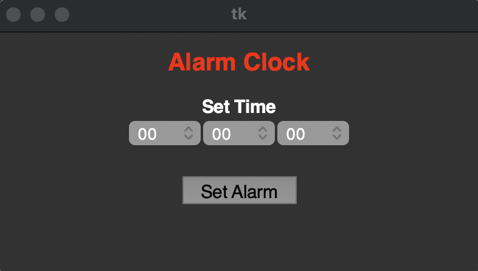

# AlarmClock

 Alarm Clock Python Application using tkinter and pygame libraries

## Pre-reqs:

Install tkinter and pygame using the command below:
```
pip3 install tkinter

pip3 install pygame
```

## How to Run AlarmClock.py:

1. Copy and save alarmclock.py locally on your PC.
2. Upload your alarm .wav or .mp3 to the /AlarmClock/ directory and save it as sound.wav or sound.mp3.
3. Save your changes.
4. Open terminal and run alarmclock.py in the terminal.
```
python3 alarmclock.py
```
5. The Alarm Clock GUI should be displayed on your screen.
6. Set you desired Alarm time and click the Set Alarm button.


7. Observe the different time-stamps in your terminal. Once it reaches your set Alarm time, your PC will make an Alarm sound from the .wav/.mp3 you've uploaded and a message "Time to Wake up" will be displayed in the terminal.

```
23:02:49 23:02:50
23:02:49 23:02:50
23:02:50 23:02:50
Time to Wake up
```


